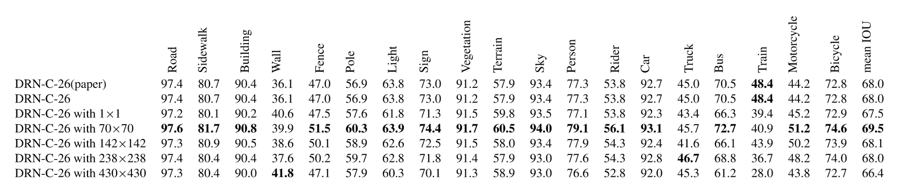
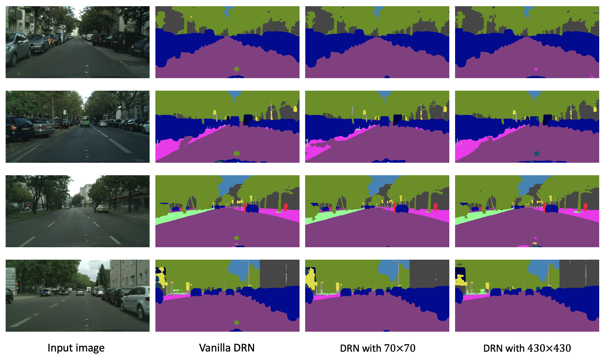

# Segmentation 

Semantic segmentation for the coursework "Computer Vision" term project. 
I investigate the impact of the GAN architeture on the [DRN](https://github.com/fyu/drn).
## Results

1. Quantitative results.

    "with*" means the receptive field size of discriminator.

<figure style="text-align: center;">
    
</figure>

2. Qualitative results

<figure style="text-align: center;">
    
</figure>
